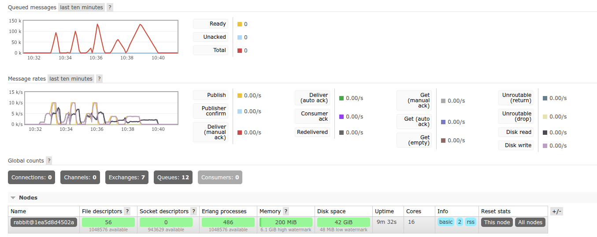

# Отчет: сравнение RabbitMQ и Redis как брокеров сообщений

## 1. Цель
Сравнить `RabbitMQ` и `Redis` как брокеры сообщений в одинаковых условиях:
- пропускная способность;
- влияние размера сообщения;
- момент деградации `single instance`

## 2. Конфигурация стенда
- Producer: `producer.py`
- Consumer: `consumer.py`
- Оркестратор тестов: `run_benchmarks.py`
- Ограничения ресурсов для обоих: CPU `2.0`, RAM `2GB`

## 3. Параметры экспериментов
- Размер сообщения: `128 B`, `1 KB`, `10 KB`, `100 KB`
- Rate: `1000`, `5000`, `10000 msg/sec`
- Duration (sec): `20 sec` (можно задать другое, но мои тесты гонялись именно на этом значении)

## 4. Результаты
| broker | size_bytes | rate_target_msg_sec | producer_sent | consumer_consumed | consumer_throughput_msg_sec | p95_latency_ms | lost_messages | degradation_flag |
| --- | --- | --- | --- | --- | --- | --- | --- | --- |
| rabbitmq | 128 | 1000 | 20000 | 20000 | 951.87 | 10.6 | 0 | 0 |
| rabbitmq | 128 | 5000 | 100000 | 100000 | 4749.83 | 32.71 | 0 | 0 |
| rabbitmq | 128 | 10000 | 200000 | 200000 | 5675.8 | 13834.09 | 0 | 1 |
| rabbitmq | 1024 | 1000 | 20000 | 20000 | 951.41 | 10.62 | 0 | 0 |
| rabbitmq | 1024 | 5000 | 100000 | 100000 | 4761.77 | 714.75 | 0 | 0 |
| rabbitmq | 1024 | 10000 | 200000 | 200000 | 5458.56 | 15154.04 | 0 | 1 |
| rabbitmq | 10240 | 1000 | 20000 | 20000 | 951.97 | 10.73 | 0 | 0 |
| rabbitmq | 10240 | 5000 | 100000 | 100000 | 3905.62 | 4633.05 | 0 | 1 |
| rabbitmq | 10240 | 10000 | 200000 | 200000 | 4238.01 | 25360.51 | 0 | 1 |
| rabbitmq | 102400 | 1000 | 20000 | 20000 | 951.83 | 11.11 | 0 | 0 |
| rabbitmq | 102400 | 5000 | 100000 | 100000 | 1600.98 | 32808.26 | 0 | 1 |
| rabbitmq | 102400 | 10000 | 200000 | 200000 | 1602.32 | 66388.53 | 0 | 1 |
| redis | 128 | 1000 | 20000 | 20000 | 952.25 | 0.54 | 0 | 0 |
| redis | 128 | 5000 | 100000 | 100000 | 4761.01 | 0.23 | 0 | 0 |
| redis | 128 | 10000 | 200000 | 200000 | 9522.07 | 4.05 | 0 | 0 |
| redis | 1024 | 1000 | 20000 | 20000 | 952.32 | 0.57 | 0 | 0 |
| redis | 1024 | 5000 | 100000 | 100000 | 4763.67 | 0.21 | 0 | 0 |
| redis | 1024 | 10000 | 200000 | 200000 | 9516.54 | 4.29 | 0 | 0 |
| redis | 10240 | 1000 | 20000 | 20000 | 952.33 | 0.63 | 0 | 0 |
| redis | 10240 | 5000 | 100000 | 100000 | 4763.59 | 0.26 | 0 | 0 |
| redis | 10240 | 10000 | 200000 | 200000 | 9520.34 | 5.43 | 0 | 0 |
| redis | 102400 | 1000 | 20000 | 20000 | 952.04 | 0.91 | 0 | 0 |
| redis | 102400 | 5000 | 100000 | 100000 | 3191.52 | 0.89 | 0 | 1 |
| redis | 102400 | 10000 | 200000 | 200000 | 3346.39 | 0.69 | 0 | 1 |

## 5. Скриншот из RabbitMQ Management

## 6. Выводы
### 6.1 Какой брокер показал большую пропускную способность

На всех тестах при равных size и duration большую пропускную способность показал Redis. Также Redis был ближе к целевому rate, RabbitMQ зачастую сильно отставал от целевой пропускной способности

### 6.2 Влияние размера сообщения

При увеличении размера сообщений оба брокера сохранили нулевые потери и ошибки. При этом у RabbitMQ p95_latency росла заметнее, соответственно Redis лучше переносит увеличение размера сообщения 

### 6.3 Точка деградации single instance

Будем считать деградацией ситуации, когда потери или ошибки больше нуля или реальная пропускная способность стала менее 90% от целевой.
RabbitMQ первый раз начал деградировать при нагрузке 1000 msg/sec и размере сообщения 128 байт. Redis начал деградировать при нагрузке 5000 msg/sec и размере сообщения 100 Кб.

### 6.4 Какой брокер лучше подходит и почему

Если нужен стабильный брокер с предсказуемой доставкой, то лучше использовать RabbiMQ. Если важнее минимальные задержки, то лучше использовать Redis.

