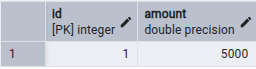
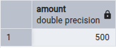
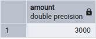
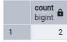
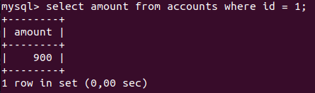
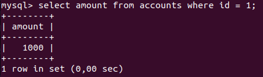

# Практика: аномалии изоляции в SQL

## Цель работы

Показать на практике, что при параллельной работе с базой данных возникают аномалии изоляции транзакций и как с ними можно бороться.

## Выбранные аномалии
В отчете воспроизведены 4 аномалии:

- `lost update`;
- `non-repeatable read`;
- `phantom read`;
- `dirty read`.

Подготовка таблицы для работы с параллельными транзакциями
```sql
create table if not exists accounts (
	id serial primary key,
	amount float not null default 0.0
);

insert into accounts(amount) values (1000), (500), (800);
```
## 1. Lost update
Будем работать с юзером с id = 1:
```sql
--устанавливаем баланс в 500 рублей 
begin;
update accounts set amount = 500 where id = 1;
commit;
```

```sql
--устанавливаем у этого же пользователя баланс в 5000
begin;
update accounts set amount = 5000 where id = 1;
commit;
```
Открываем первую транзакцию (делаем только begin). Далее полность выполняем вторую транзакцию. После этого запрос `select amount from accounts where id = 1` вернет 5000. 



Теперь выполняем вторую и третью строчки кода первой транзакции. Теперь баланс у юзера с id = 1 - 500 рублей.


То есть, данные, внесенные второй транзакцией, были затерты первой. 

Для борьбы с lost update можно использовать такие уровни сериализации, как Repeatable Read или Serializable. Также можно использовать конструкцию select for update - строка будет заблокирована для обновлениями другими транзакциями до тех пор, пока не завершится текущая транзакция.


## 2. Non-repeatable read
```sql
--транзакция 1, просто дважды будем считывать баланс счета с id = 2
begin;
select amount from accounts where id = 2;
select amount from accounts where id = 2;
commit;
```

```sql
--транзакция 2, изменяем баланс счета с id = 2
begin;
update accounts set amount = 3000;
commit;
```
Сначала выполним две первые строки кода первой транзакции. БД вернет значение 500. 



Далее полностью выполним и закоммитим вторую транзакцию. Теперь на счету с id = 2 лежит 3000 рублей. 



Теперь выполним оставшиеся две строки первой транзакции - вернется 3000, т.е. один и тот же запрос в рамках одной транзакции вернул разные данные, сначал 500, а потом 3000.

Чтобы бороться с этой аномалией в PostgreSQL, можно использовать уровни изоляции Repeatable Read или Serializable. Тогда транзакции будут видеть БД в том состоянии, в котором она была до начал выполнения транзакции.


## 3. Phantom read
```sql
--дважды запрашиваем количество записей в таблице, в которых баланс > 700
begin;
select count(*) from accounts where amount > 700;
select count(*) from accounts where amount > 700;
commit;
```

```sql
--добавляем в БД запись с балансом 2500 рублей
begin;
insert into accounts(amount) values (2500);
commit;
```

Сначала выполним первые две строчки первой транзакции. Вернется число 2



Далее полностью выполним вторую транзакцию. Добавилась запись с балансом 2500 рублей. Теперь выполним оставшиеся две строчки первой транзакции. SELECT вернет значение 3, т.е. один и тот же запрос вернул разное количество строк.


Чтобы избежать этой аномалии, в PostgreSQL используют уровни изоляции Repeatable Read или Serializable.

## 4. Dirty read
Продемонстрировать Dirty read в PostgreSQL невозможно, т.к. уровень изоляции Read Uncommitted автоматически поднимается до Read Committed, поэтому я буду использовать MySQL. В ней создаем таблицу, аналогичную таблице выше.

```sql
SET SESSION TRANSACTION ISOLATION LEVEL READ UNCOMMITTED;
start transaction;
update accounts set amount = 900 where id = 1;
rollback;
```

```sql
SET SESSION TRANSACTION ISOLATION LEVEL READ UNCOMMITTED;
start transaction;
select amount from accounts where id = 1;
select amount from accounts where id = 1;
commit;
```

Сначала выполним первые две строчки каждой транзакции (просто запустим их на уровне изоляции read uncommitted). Далее выполним третью строчку перовй транзакции - обновим баланс у первого юзера - теперь он будет равен 900. Во второй транзакции прочитаем текущий баланс у этого юзера - он равен 900, т.е. мы прочитали незакоммиченные изменения:



Теперь выполним rollback в первой транзакции. Изменения откатились - теперь у первого юзера снова баланс 1000 рублей. Проверим это во второй транзакции (4 строка) - вернулась действительно 1000. После этого коммитим вторую транзакцию.



Получается, что в первой транзакции мы работали с данными, которые никогда не сущетсвовали (не были закоммичены).
Чтобы избежать dirty read в MySQL нужно использовать любой уровень изоляции, кроме Read uncommitted.


